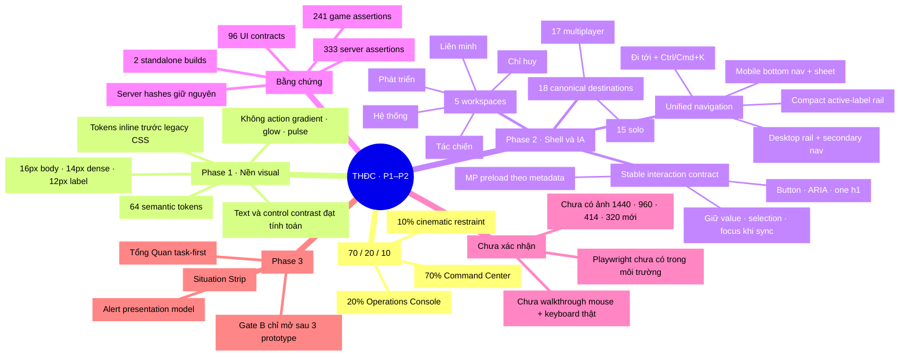

# Mindmap review — Phase 1–2 Command Workbench

Ngày: 2026-08-26 · Phạm vi: token, visual foundation, app shell và IA năm
workspace · Trạng thái: code/contract/build đạt; visual browser đang chờ.

## Evidence ledger

| Hạng mục | Kết quả |
|---|---|
| `npm test` | 96 UI contracts + 241 luật game + 333 server assertions đạt |
| Syntax | `js/ui.js`, `js/app.js`, `js/main.js`, `web/js/mp.js`, test và build scripts đạt |
| Build | `dist/thien-ha-dai-chien.html` và `dist/artifact.html` sinh lại thành công |
| Server ngoài scope | `server/api.js` và `server/index.js` giữ đúng hash baseline |
| Browser-native | Chưa chạy: thiếu Playwright (`ERR_MODULE_NOT_FOUND`) |

## Điểm review

- Phase 1–2 đã đủ bằng chứng để tiếp tục phát triển code sang Phase 3.
- Chưa dùng kết quả structural test thay cho bằng chứng layout, mouse hoặc
  keyboard thật.
- Gate B chưa mở: cần hoàn thiện Tổng Quan, Thiên Hà và Tài Nguyên rồi chụp bốn
  viewport theo plan trước khi nhân rộng migration qua toàn bộ page family.

Liên kết: [implementation plan](../plans/2026-08-25-trung-tam-chi-huy-hybrid.md) ·
[UX/IA spec](../specs/2026-08-25-trung-tam-chi-huy-hybrid-design.md) ·
[mindmap định hướng Gate A](2026-08-25-trung-tam-chi-huy-review.html).
