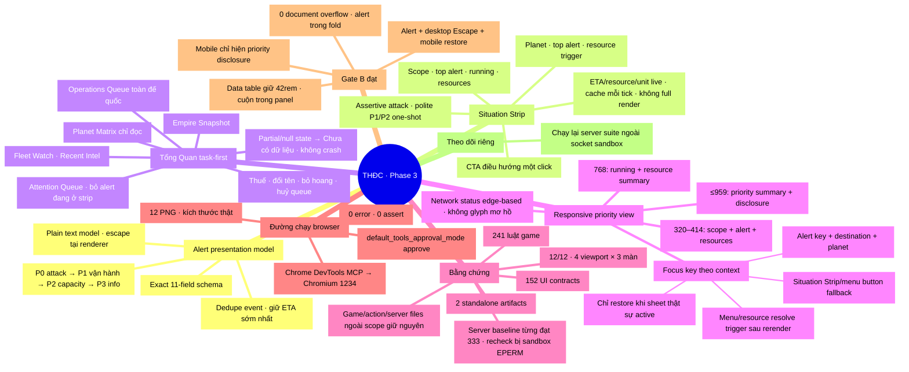

# Mindmap review — Phase 3 Situation Strip & Command Workbench

Ngày: 2026-08-26 · Trạng thái: Phase 3 và browser visual Gate B đạt trên
Chromium 1234; server regression còn chờ môi trường cho phép bind port.

## Evidence ledger

| Hạng mục | Kết quả |
|---|---|
| UI contract | 152/152 đạt |
| Luật game | 241/241 đạt |
| Server suite | Baseline trước đó 333/333; một lượt báo 332/333 ở số dư Galana, các lượt tái hiện sau bị sandbox chặn `listen` với `EPERM` nên giữ trạng thái cần recheck riêng |
| Syntax/diff | `node --check` và `git diff --check` đạt |
| Build | Hai file trong `dist/` được sinh lại thành công |
| Server integrity | Hai file server giữ đúng hash baseline |
| Browser MCP | Chrome DevTools MCP chạy thành công bằng Chromium `1234` với approval policy đã nạp |
| Browser matrix | 12/12 Tổng Quan/Thiên Hà/Tài Nguyên × 1440/960/414/320 đạt render, overflow, fold, disclosure, Matrix và data-table |
| Keyboard/focus | Alert đổi identity, Escape desktop, resource restore và workspace restore mobile đều đạt |
| Browser console | Không có `error` hoặc failed `assert` |
| Screenshots | Đủ 12 PNG đúng kích thước trong `docs/superpowers/evidence/2026-08-26-gate-b/` |

## Review boundary

- Phase 3 đủ điều kiện review ở code/contract layer.
- Không dùng structural assertions thay cho bằng chứng layout, mouse hoặc
  keyboard thật.
- Hallmark audit đã bỏ side-stripe trang trí, giữ severity bằng dot + text,
  chuyển Matrix tablet/mobile sang priority disclosure và không xoay theme.
- Presentation fingerprint chỉ giữ focus/chặn control cũ trong snapshot client;
  không thêm field state và không đổi action/API contract.
- Alert CTA, menu và resource disclosure phục hồi focus bằng khóa ổn định sau
  full render; chỉ restore khi responsive sheet thật sự active. Nếu trigger không
  còn, focus hạ về landmark/nút mở phù hợp.
- Chrome DevTools MCP đã chạy Chromium 1234 và kiểm trực tiếp artifact build.
- Vòng browser đầu phát hiện hai lỗi mà structural contract chưa bắt được:
  selector bảng Matrix yếu hơn rule responsive chung, và bảng dữ liệu bị ép cột
  thành chữ dọc. CSS đã tăng specificity đúng phạm vi, giữ data table tối thiểu
  42rem và cuộn trong panel; không dùng `!important` hoặc tạo overflow toàn trang.
- Vòng cuối đạt 12/12 tổ hợp Tổng Quan/Thiên Hà/Tài Nguyên ×
  1440/960/414/320, gồm heading, fold, document overflow, shell breakpoint,
  resource disclosure, Planet Matrix và data-table readability.
- Đã review trực quan ảnh thật; không còn chữ dọc, cắt panel hoặc chồng navigation.
  Console không có error/assert và bốn luồng focus/keyboard trọng yếu đều đạt.
- Regression cuối xác nhận 152 UI contracts và 241 luật game đạt; build hai
  artifact, syntax runner và `git diff --check` đạt. Server suite chưa thể tái
  xác nhận trong lượt cuối vì sandbox từ chối bind `0.0.0.0` với `EPERM`.
- Gate B đóng ở browser/UI layer. Server recheck được tách thành việc theo dõi
  môi trường, không dùng để che khuất kết quả visual đã có bằng chứng.

Liên kết: [implementation plan](../plans/2026-08-25-trung-tam-chi-huy-hybrid.md) ·
[UX/IA spec](../specs/2026-08-25-trung-tam-chi-huy-hybrid-design.md) ·
[review Phase 1–2](2026-08-26-phase-1-2-implementation-review.md).
